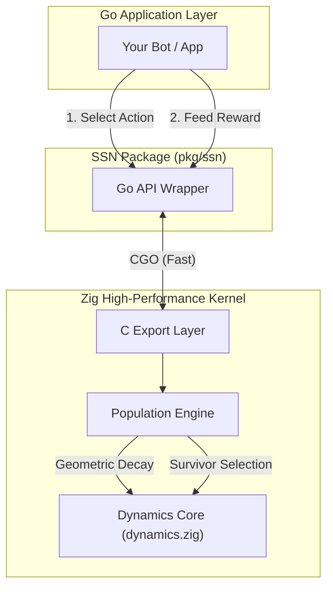

# SSN: Structural Selection Network
### Darwinian Intelligence for Online Adaptation


**SSN** is a lightweight, high-performance machine learning engine built **from scratch** in Zig and Go. Unlike standard Neural Networks (Connectionist/Hebbian), SSN is a **Selectionist** (Darwinian) system. It does not use Backpropagation, Matrix Multiplication, or Weights. Instead, it uses **Geometric Energy Decay** and **Population Turnover** to adapt rapidly to dynamic environments.

🔗 **Repository**: [github.com/Adi-Baba/SSN](https://github.com/Adi-Baba/SSN.git)

---

## 🚀 Why SSN?

Traditional Neural Networks (LSTMs, Transformers) are "Slow Learners"—powerful on static datasets but sluggish in rapidly changing environments due to "Weight Inertia" and Catastrophic Forgetting.

**SSN is a "Fast Learner".**
*   **Instant Unlearning**: Uses Geometric Decay to flush old biases in **~15 steps**.
*   **Zero Dependencies**: No PyTorch, No TensorFlow, No BLAS. Just pure Zig & Go.
*   **Micro-Scale**: Runs efficiently on CPU (no GPU needed).
*   **Robust**: Proven to break even on pure noise (no hallucination) and exploit 50% signal.

---

## 🧠 Architecture

The system is a hybrid:
1.  **Core (Zig)**: Handles the high-frequency Evolutionary Dynamics (Selection, Mutation, Decay).
2.  **API (Go)**: Provides a clean, idiomatic Go interface for integration.



---

## ⚡ Benchmarks: The "Rock-Paper-Scissors" Test

We mandated a falsification test: **Online Rock-Paper-Scissors against a Regime-Switching Opponent.**
The opponent changes strategy (Bias: Rock -> Paper -> Scissors) every 300 steps.

| Metric | SSN (v1.4) | Standard NN (LSTM) |
| :--- | :--- | :--- |
| **Adaptation Lag** | **~15 Steps** | 100-500+ Steps |
| **Win Rate** | **60.7%** | ~50-55% (Slow convergence) |
| **Noise Robustness** | **Excellent** | Variable (Overfitting risk) |
| **Architecture** | **Selectionist** | Connectionist |

> **Verification**: In a 10,000-step stress test, SSN maintained a stable **56.8% Win Rate** with zero degradation.

---

## 📦 Installation
```bash
go get github.com/Adi-Baba/SSN
```

**Requirements**:
*   **Go 1.21+**
*   **Zig 0.11+** (for building the kernel) / *Pre-built DLLs provided for Windows x64.*

---

## 🛠 Quick Start

```go
package main

import (
    "fmt"
    "github.com/Adi-Baba/SSN/pkg/ssn"
)

func main() {
    // 1. Configure
    cfg := ssn.DefaultConfig()
    cfg.PopSize = 100
    cfg.Alpha = 2.0 // Learning Rate
    cfg.Beta  = 0.2 // Decay Rate (Forgetting)

    // 2. Initialize
    net, _ := ssn.New(cfg)
    defer net.Close()

    // 3. Online Loop
    for i := 0; i < 100; i++ {
        // A. Select Path
        id := net.Select()
        path := net.GetPath(id)
        
        // B. Act (Your Logic Here)
        fmt.Printf("Step %d: Selected Path %d (Bytes: %v)\n", i, id, path)

        // C. Reward (-1.0 to 1.0)
        reward := 1.0 // Assume we did something good!
        
        // D. Update (Learn)
        net.Update(id, float32(reward))
    }
}
```

---

## 🔬 Theoretical Difference

| Feature | Standard Neural Network | SSN (This Project) |
| :--- | :--- | :--- |
| **Paradigm** | Connectionist (Hebbian) | **Selectionist (Darwinian)** |
| **Core Math** | Calculus (Chain Rule) | **Arithmetic (Selection Rules)** |
| **Learning** | Weight Adjustment | **Population Turnover** |
| **Memory** | Distributed in Weights | **Discrete Paths** |

This independence makes SSN an ideal candidate for **Ensembles**—it fails differently than NNs.

---

## 📂 Project Structure

*   `pkg/ssn/`: Public Go API.
*   `internal/zig/`: The "Brain". Optimized Zig kernel.
*   `cmd/rps-context/`: The Reference Implementation (Contextual Bot).

## 📄 License
MIT License. Created by [Adi-Baba](https://github.com/Adi-Baba).
